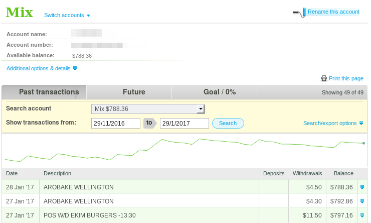

# kiwibank-sparkline

[**INSTALL**](https://github.com/mixmix/kiwibank-sparkline/releases/download/v1.1.0/kiwibank_sparkline-1.1-an.fx.xpi) (github release)

This webextension activates on kiwibank account pages, and augments it with a sparkline visualisation of the bank records currently displayed on the page.

The intention is to enable people to see longer term trends in their money.

## Install 

You can install Mozilla signed versions of the addon from the [releases page](https://github.com/mixmix/kiwibank-sparkline/releases).

If you'd rather install from the [firefox addon page](https://addons.mozilla.org/en-US/firefox/addon/kiwibank-sparkline/), you'll have to wait for the community to review code.

## Development

To develop this, remember you need to bundle the project (`npm run build`).
I've provided some `sampleData.json` generated by `scrapeAccountData.js` which may be useful.

To build this locally, clone this repo, run `npm install`, then `npm run build`.
To load the extension into firefox, browse to `about:debugging` then load in this projects `bundle.js`

For more details check out: https://developer.mozilla.org/en-US/Add-ons/WebExtensions/Your_first_WebExtension

For some sweet dev tooling (hot reload, building, signing), see: https://developer.mozilla.org/en-US/Add-ons/WebExtensions/Getting_started_with_web-ext

